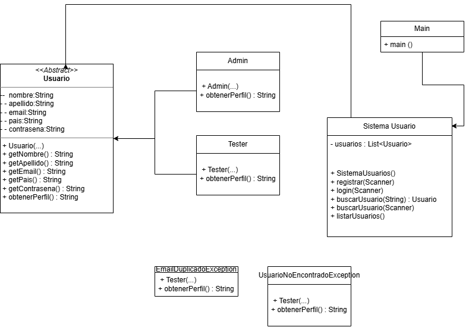

# CES-INTRODUCCI-N-A-LA-PROGRAMACI-N-PARA-TESTERS
# Sistema de Gestión de Usuarios

## Descripción

Aplicación desarrollada en Java que permite gestionar usuarios mediante un sistema de autenticación con diferentes perfiles.

El sistema permite registrar administradores, registrar testers, iniciar sesión, consultar usuarios y administrar la información almacenada utilizando programación orientada a objetos.

---

# Funcionalidades

## 1. Registro de Administrador

### Descripción
Permite crear usuarios con perfil Administrador dentro del sistema.

### Datos utilizados

- Nombre
- Apellido
- Email
- País
- Contraseña

### Validaciones

- Campos obligatorios
- Email con formato válido
- Email no repetido
- Contraseña con longitud mínima

---

## 2. Registro de Tester

### Descripción
Permite al administrador crear usuarios con perfil Tester.

### Datos utilizados

- Nombre
- Apellido
- Email
- País
- Contraseña
- Nivel de Tester

### Niveles disponibles

- Tester Junior
- Tester Senior
- Tester Líder

### Observaciones

El nivel permite diferenciar el tipo de perfil del tester dentro del sistema.

---

## 3. Inicio de Sesión

### Descripción

Permite acceder al sistema mediante email y contraseña.

### Validaciones

- Verificar existencia del usuario
- Verificar contraseña correcta

### Resultado

Según el usuario autenticado se habilitan diferentes opciones del menú.

---

## 4. Administración de Usuarios

### Descripción

Funcionalidades disponibles para usuarios con sesión iniciada como administrador.

### Acciones disponibles

- Registrar Tester
- Listar usuarios
- Buscar usuarios por email
- Cerrar sesión

---

## 5. Listado de Usuarios

### Descripción

Permite visualizar todos los usuarios registrados.

### Datos mostrados

- Nombre
- Apellido
- Email
- Perfil

---

## 6. Búsqueda de Usuarios

### Descripción

Permite buscar usuarios registrados mediante su email.

### Validaciones

- Verificar existencia del email
- Informar si el usuario no existe

---

## 7. Manejo de Excepciones

El sistema incorpora excepciones para controlar errores y evitar cierres inesperados.

### Excepciones personalizadas

- EmailDuplicadoException
  - Se genera cuando se intenta registrar un email existente.

- UsuarioNoEncontradoException
  - Se genera cuando no existe un usuario con el email ingresado.

---

# Diseño del Sistema

El proyecto aplica conceptos de Programación Orientada a Objetos:

- Encapsulamiento mediante atributos privados y métodos getters/setters.
- Herencia entre Usuario, Admin y Tester.
- Polimorfismo mediante el método obtenerPerfil().
- Uso de colecciones con ArrayList.
- Patrón Singleton para administrar una única instancia del sistema.

---

# Estructura del Proyecto
src
└── usuario
├── Main.java
├── SistemaUsuarios.java
├── Usuario.java
├── Admin.java
├── Tester.java
└── excepciones
├── EmailDuplicadoException.java
└── UsuarioNoEncontradoException.java
# Diagrama UML

---

# Ejecución

1. Clonar el repositorio.
2. Abrir el proyecto en IntelliJ IDEA.
3. Ejecutar la clase Main.java.
4. Utilizar el menú de opciones.